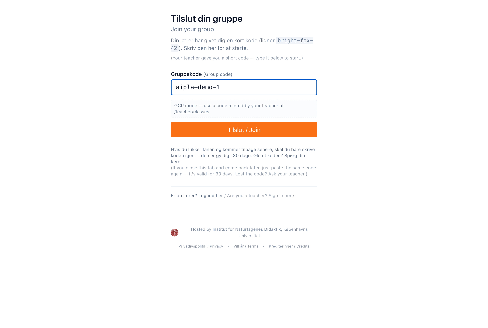
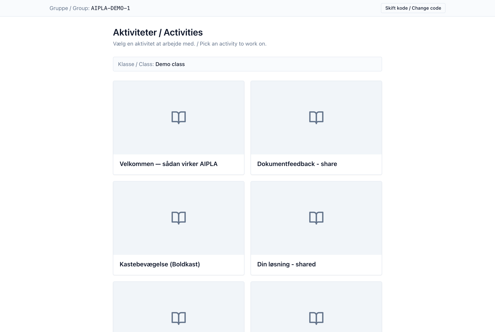
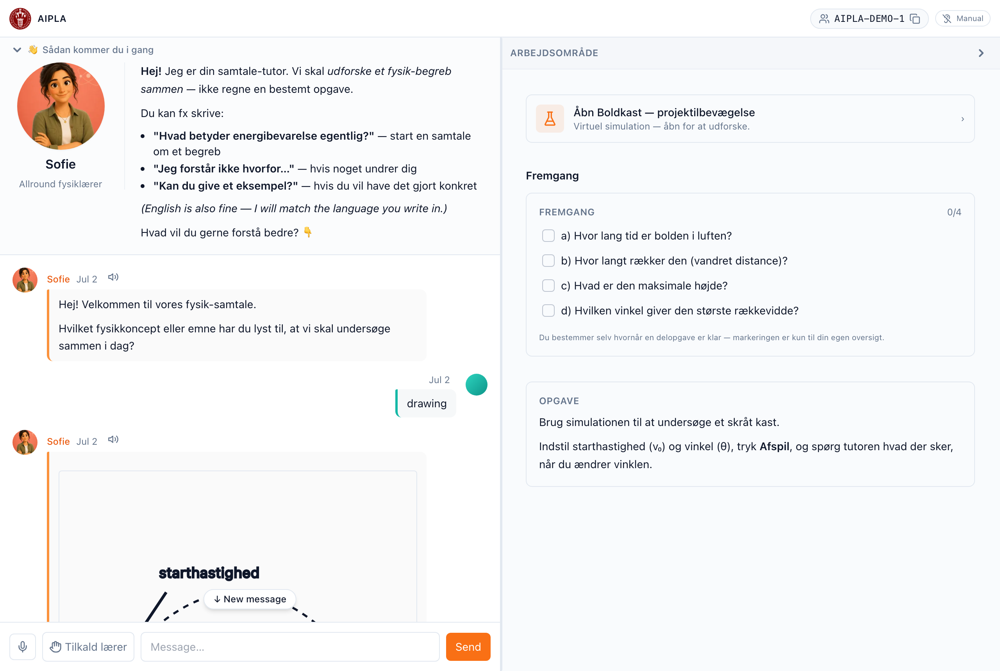

::: callout-note
## For students

You do not need an account or a password. Your teacher gives you a short
**group code** — that is all you need to start. This takes about a minute.
:::

## Step 1 — Open the link and type your code

Open the student link your teacher gave you. You will see a join page. Type
your **group code** — it looks like `bright-fox-42` — and select **Join**
(*Tilslut*).

Your code keeps your group's work together. There is nothing to remember and
nothing to install.

## Step 2 — Choose your activity

After you join, you see the **activities** your teacher has set up. Select the
one you are working on.

## Step 3 — Work with the tutor

The activity opens with two sides: the **tutor** you chat with, and your
**workspace** — a simulation, a checklist, a table, or notes, depending on the
activity. Ask the tutor questions in your own words; it guides you toward
understanding rather than just giving answers.

::: callout-tip
Anything you do in the workspace — values you enter, a simulation you run,
steps you tick off — is shared with the tutor, so it can help you with your
actual work.
:::

## If your code stops working

Group codes can expire, or your teacher may give you a new one. If joining
fails, ask your teacher for the current code. Closing the tab signs you out of
the group — just open the link and type your code again.
