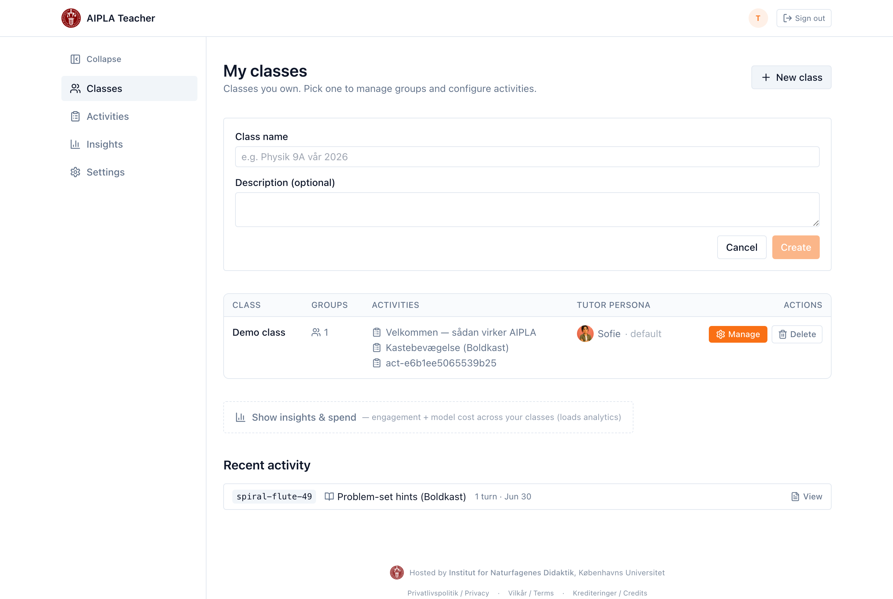
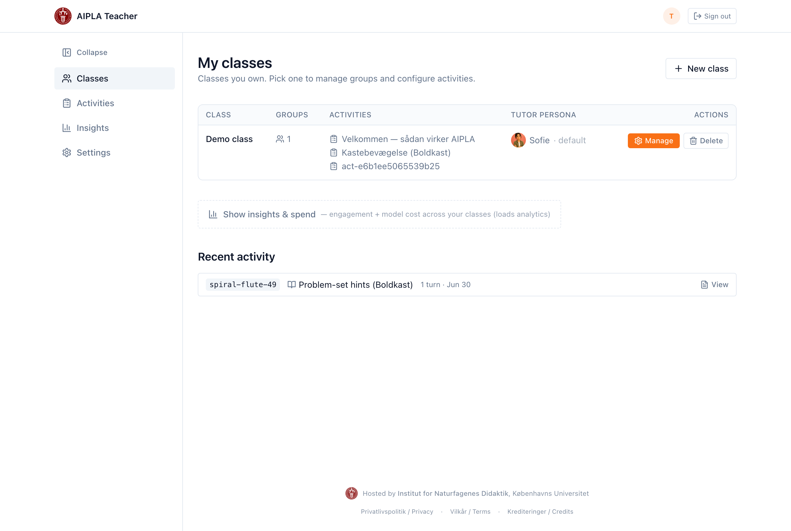
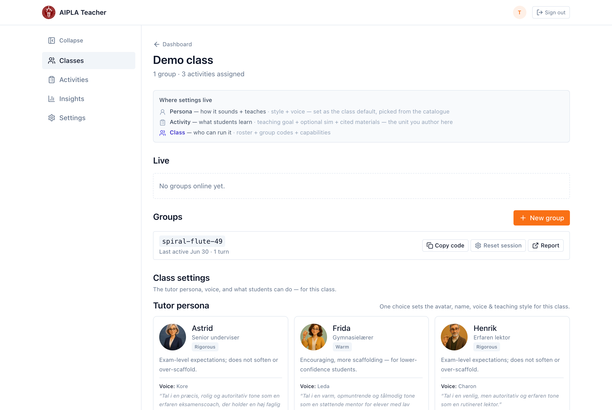

::: callout-note
## Where this fits

A **class** is the starting point for everything else. It holds your students
(as anonymous groups, no personal accounts) and the activities you build for
them. Do this once per class; it takes about three minutes. Afterwards, follow
*T2 — Create your first activity*.
:::

## What a class is

In AIPLA a **class** is a container you own. It has:

- one or more **group codes** — the short codes students type to join. Students
  do not create accounts and do not log in; the group code is all they need.
- the **activities** you assign to it (guide *T2*).
- a **tutor persona** — the voice and style of the AI tutor for this class,
  which you can leave as the default or change later.

Everything below is done in your browser. You do not need a developer.

::: callout-tip
## The co-pilot can do this for you

The class list has an AI **co-pilot** panel. You can create a class and mint
group codes by asking it in plain language, instead of using the forms below —
see *T4 — Author with the AI co-pilot*.
:::

## Step 1 — Create the class

From your teacher area, open **Classes** and select **New class**. Give the
class a **name** — for example, *"Physik 2.g, autumn 2026"* — and, optionally,
a short description. Select **Create**.

Your new class now appears in the class list, alongside any others you own.

## Step 2 — Mint a group code

Open the class with **Manage**. A new class has no group codes yet, so select
**New group**. AIPLA generates a short code and copies it to your clipboard.

You can mint more than one group code for the same class — for example, one per
table group or per lab pair — so you can tell their work apart in reports.

## Step 3 — Share the code with students

Give students the group code. They open the student link, type the code, and
they are in — no login, no personal account (see *S1 — Join and use your
tutor*). Anything they do is grouped under that code, so your class reports
stay organised.

::: callout-tip
Group codes are how you separate one class — or one lab group — from another in
the reports. Mint a fresh code for each group you want to track separately.
:::

## Next steps

- Build the first activity for this class — *T2 — Create your first activity*.
- Add curriculum documents the tutor can draw on — *T3 — Add and organise
  curriculum materials*.
