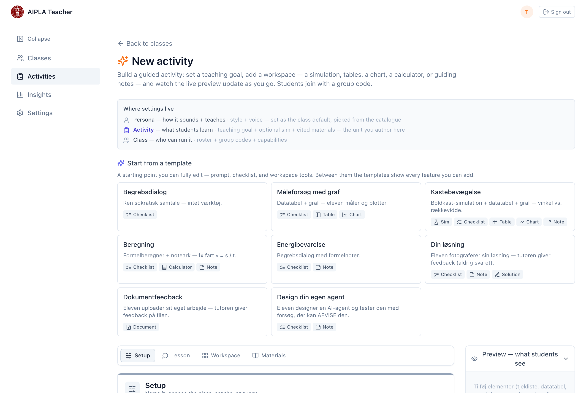
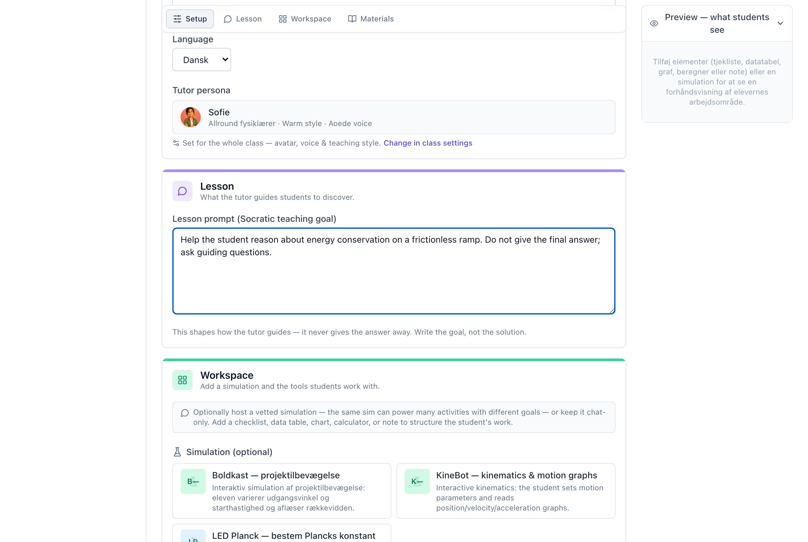
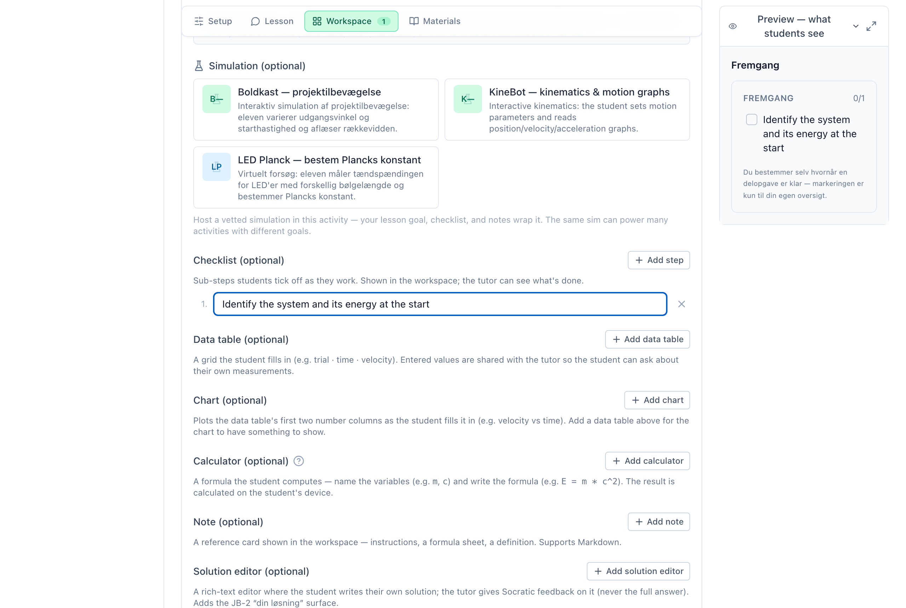
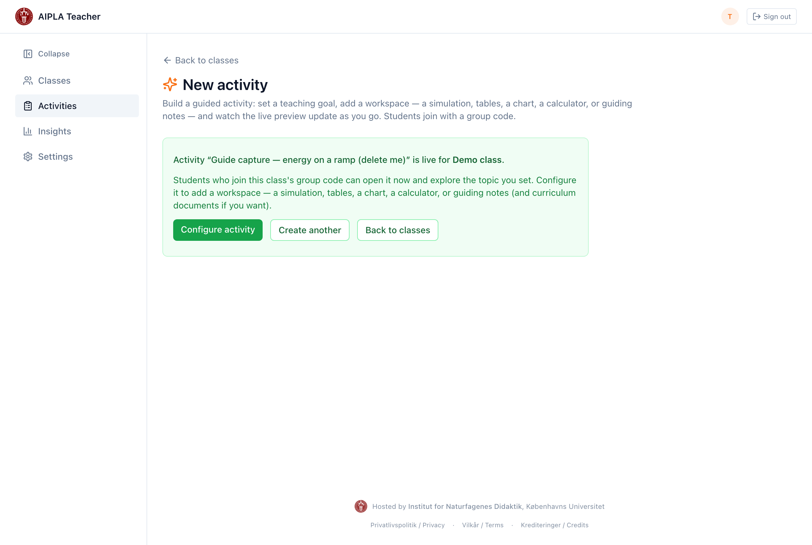

::: callout-note
## Before you start

An activity always belongs to a **class**. If you have not created a class
yet, follow guide *T1 — Set up a class and share it* first, then come back
here. This guide takes about five minutes.
:::

## What an activity is

An **activity** is a single guided task your students open in the tutor. You
set the teaching goal and, optionally, a workspace — a simulation, a table, a
chart, a calculator, or guiding notes. Students join with the class group code
and work through the activity in conversation with the AI physics tutor, which
follows the goal you set.

You do not need to write any code, and you do not need a developer. Everything
on this page is done in your browser.

::: callout-tip
## Prefer to describe it in words?

The builder has an AI **co-pilot** (bottom-right). Tell it what you want to
teach and it drafts a teaching goal and workspace elements you can edit and
apply — see *T4 — Author with the AI co-pilot*. Every step below can also be
done by the co-pilot, not only by hand.
:::

## Step 1 — Open the activity builder

From your teacher area, open **Classes**, choose the class this activity is
for, and select **New activity**. (You can also reach the builder from the
class page's **New activity** button, which pre-selects that class for you.)

## Step 2 — Choose a starting point

At the top of the builder is a **template picker**. Pick a template close to
what you want — it fills in a sensible starting configuration — or start from
blank. You can change everything afterwards, so the choice is not binding.

## Step 3 — Set the teaching goal

Give the activity a **title** and a **teaching goal**. The goal is the most
important field: it is the instruction the tutor follows when it talks to your
students. Write it as you would brief a teaching assistant — for example,
*"Help the student reason about energy conservation on a frictionless ramp;
do not give the final answer, ask guiding questions."*

Set the **language** the tutor should use with students, and pick a
**workbench type** if this activity needs a workspace (or leave it as a
chat-only conceptual dialogue).

## Step 4 — Add a workspace (optional)

If you chose a workbench, add the elements your students will use — a
simulation, a table to fill in, a chart, a calculator, or notes. The **live
preview** on the right updates as you add each element, so you see exactly
what the student will see.

::: callout-tip
Anything the student does in the workspace — values they enter, a simulation
they run — is shared with the tutor, so it can respond to their actual work.
:::

## Step 5 — Create the activity

When you are happy with the preview, select **Create activity**. You will see
a confirmation that the activity is live for your class.

From the confirmation you can:

- **Configure activity** — reopen it to add curriculum documents or refine the
  goal (see *T3 — Add and organise curriculum materials*).
- **Create another** — start a fresh activity for the same class.
- **Back to classes** — return to your class list.

## What students see

Students open the activity from the class group code (no login, no personal
account — see *S1 — Join and use your tutor*). They get the tutor and, if you
added one, the workspace. The tutor follows the goal you set and can see the
work the student does in the workspace.

## Next steps

- Add curriculum documents so the tutor can ground its answers in your
  materials — *T3*.
- Let the AI authoring co-pilot draft an activity from a plain-language
  description — *T4 — Author with the AI co-pilot*.
