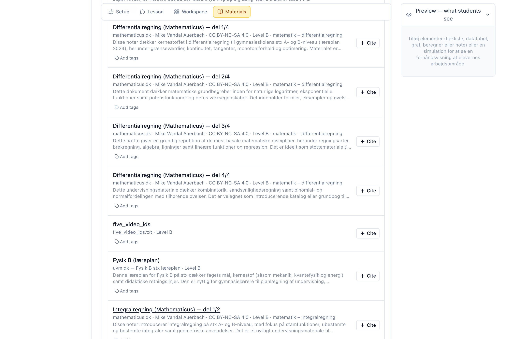
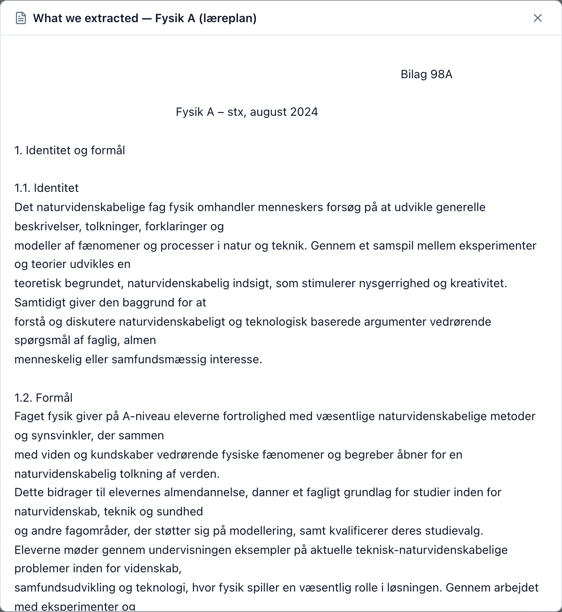

::: callout-note
## Where this fits

Curriculum materials are added **inside an activity** (guide *T2*). Open an
activity, go to its **Materials** section, and attach the documents you want
the tutor to draw on. There is no separate library to manage — you organise
materials in place, in the context of the activity that uses them.
:::

## What materials do

When you attach a document to an activity, the tutor can **cite it** — ground
its answers in your source rather than in general knowledge. You can attach:

- documents from the **shared corpus** — material already available to you, and
- your **own uploads** — a PDF, slides, a worksheet, notes, or an image.

Each attached document is either **visible** to students or **hidden** (used
only to ground the tutor). You choose per document.

::: callout-tip
## The co-pilot can help here too

When it drafts an activity, the AI **co-pilot** can also suggest curriculum
materials to attach — see *T4 — Author with the AI co-pilot*. You can always
add and organise materials by hand as below.
:::

## Step 1 — Open the Materials section

Open an activity for editing (or create one — guide *T2*). In the builder's
section navigation, select **Materials**. The section lists the shared corpus
you can browse, with an **Upload** button and controls to filter and organise.

## Step 2 — Attach a document

You have two ways to attach material:

- **Cite an existing document.** Use the **Search materials** box or the
  **level**, **tag**, **subject** and **folder** filters to find what you want,
  then select **Cite** on its row. It moves into the activity's cited list.
- **Upload your own.** Select **Upload** and choose a file (PDF, Word, slides,
  spreadsheet, plain text, or an image). AIPLA extracts the text and shows you
  **what it extracted**, so you can confirm the document was read correctly
  before relying on it.

## Step 3 — Organise: folders, tags and subject

Keep a growing corpus navigable:

- **Folders** — group related documents; create one with **New** in the folder
  rail. Deleting a folder unfiles its documents rather than deleting them.
- **Tags** and **Subject** — set on a document so the filters can find it later.

These are shared organisation, so a document you tag well is easier for you and
your colleagues to reuse across activities.

## Step 4 — Control what students see

Each cited document has a **Visible / Hidden** toggle. Hidden documents still
ground the tutor's answers; visible documents also appear to students in the
activity. New uploads default to **Hidden** — make a document visible only when
you want students to read the source directly.

::: callout-tip
Grounding works whether a document is visible or hidden. Use *hidden* for
source material that should shape the tutor's answers without being handed to
students verbatim.
:::

## Next steps

- Let the AI co-pilot assemble an activity — including suggested materials —
  from a description: *T4 — Author with the AI co-pilot*.
