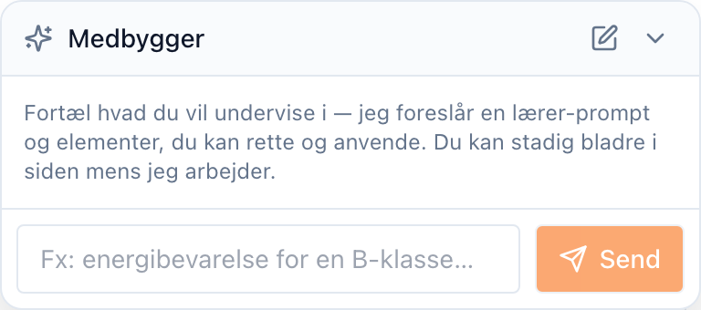
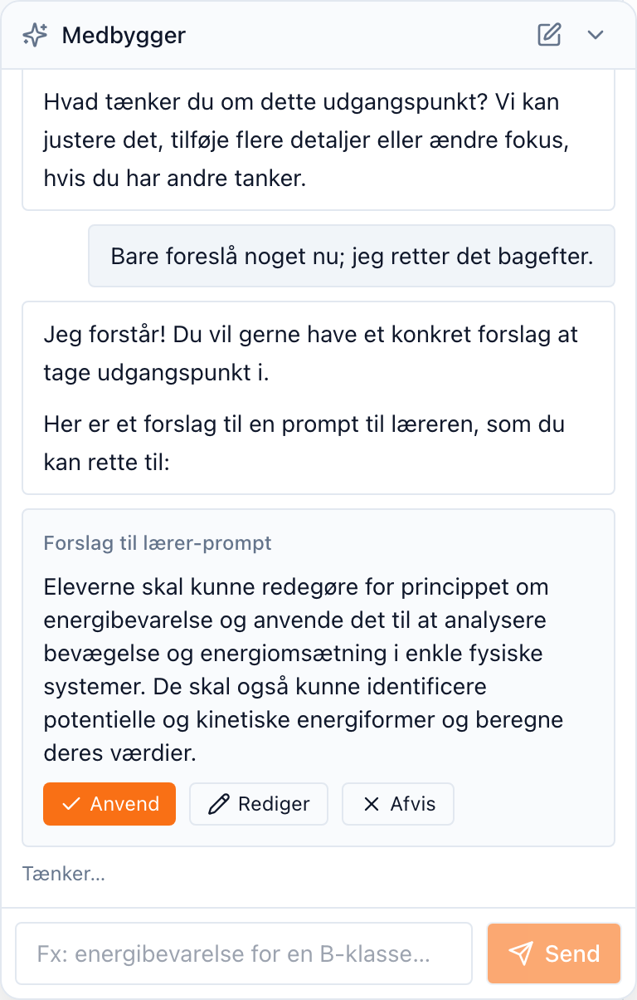

::: callout-note
## Hvor dette passer ind

AI-**medbyggeren** findes inde i aktivitetsbyggeren (vejledning *T2*). I stedet
for at udfylde hvert felt i hånden beskriver du, hvad du vil undervise i, og
medbyggeren foreslår et undervisningsmål og elementer til arbejdsområdet. Du
gennemgår hvert forslag og bestemmer, hvad du beholder. Intet ændres, før du
godkender det.
:::

## Hvad medbyggeren gør

Medbyggeren (mærket **Medbygger**) læser en beskrivelse i almindeligt sprog af
din lektion og udkaster:

- et **undervisningsmål** (den sokratiske prompt, tutoren følger),
- **elementer til arbejdsområdet** — en tjekliste, en note, en tabel, en
  beregner og så videre, og
- foreslåede **pensummaterialer**, der kan vedhæftes (vejledning *T3*).

Hvert forslag ankommer som et **forslag**, du kan anvende, redigere eller
afvise. Du bevarer kontrollen: medbyggeren ændrer aldrig aktiviteten på egen
hånd.

## Trin 1 — Åbn byggeren

Opret eller åbn en aktivitet (vejledning *T2*). Medbygger-panelet sidder
**nederst til højre** i byggeren. Det åbner klar til en beskrivelse.

## Trin 2 — Beskriv, hvad du vil undervise i

Skriv en kort beskrivelse — for eksempel *"energibevarelse for en 2.g-klasse,
med en tjekliste og et gennemregnet eksempel"* — og vælg **Send**. Medbyggeren
tænker et øjeblik og returnerer så et eller flere forslag.

## Trin 3 — Gennemgå hvert forslag

Hvert forslag er et kort: et foreslået undervisningsmål, en tjekliste, en note,
en tabel og så videre. For hvert af dem kan du:

- **Anvend** — accepter forslaget ind i dit udkast,
- **Rediger** — juster det først og anvend det derefter, eller
- **Afvis** — afvis det.

## Trin 4 — Anvend og forfin

Når du anvender et forslag, falder det ned i det tilsvarende felt i byggeren —
og forbliver fuldt redigerbart. Anvendte forslag er markeret, så du kan se, hvad
medbyggeren bidrog med. Bliv ved med at forfine i hånden, eller bed om mere.

Når aktiviteten ser rigtig ud, **gem** den som sædvanligt (vejledning *T2*).
Intet af det, medbyggeren foreslog, er live, før du gemmer aktiviteten.

::: callout-tip
Medbyggeren foreslår; du bestemmer. Hver ændring venter på din **Anvend**, og
selv anvendte ændringer forbliver redigerbare, indtil du gemmer — så det er
sikkert at udforske dens forslag frit.
:::

## Næste skridt

- Vedhæft kildedokumenter, tutoren kan citere — *T3 — Tilføj og organisér
  pensummaterialer*.
- Del aktiviteten med elever — *T1 — Opret en klasse og del den*.
